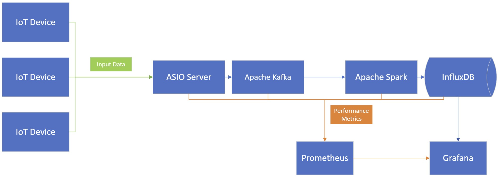

# Distributed Real-Time Data Processing System

## Introduction
This project is a C++ implementation of a distributed real-time data processing system. It currently consists of a mock IoT device, an ASIO server, and Apache Kafka producer and consumer. The IoT devices send JSON data to the ASIO server, which then forwards it to the Kafka broker. The Kafka consumer reads the data.

## Setup Instructions
1. **Add Asio standalone:** Download `asio_1_30_2` from [their website](https://think-async.com/Asio/Download.html). Place the `asio.hpp` file and `asio` folder in a `/src/include` directory of this project.
2. **nlohmann's JSON:** Download `include.zip` from [GitHub releases](https://github.com/nlohmann/json). Place the `nlohmann` folder containing header.hpp into a `/src/include` directory of this project.
3. Install [librdkafka](https://github.com/confluentinc/librdkafka?tab=readme-ov-file#installation), [pkg-config](https://www.freedesktop.org/wiki/Software/pkg-config/) and [glibc](https://www.gnu.org/software/libc/). You will need to use WSL if on Windows.
4. Install and start Docker Desktop or Docker Engine. Install the [Confluent CLI](https://docs.confluent.io/confluent-cli/current/install.html) in the terminal.
5. Start the Kafka broker ``confluent kafka start`` and create a topic ``confluent kafka topic create iot-data``.

## Usage
1. **Server:** Compile and run `server.cpp` to start the server. It listens for incoming JSON data on port `1234`.
2. **Client:** Compile and run `client.cpp` to simulate IoT data and send it to the server.

## Project Roadmap (WIP)

### Features implemented
- [x] IoT Devices
- [x] ASIO Server
- [ ] Apache NiFi for preprocessing
- [x] Apache Kafka (Producer)
- [x] Apache Kafka (Consumer)
- [ ] Apache Flink for stream processing
- [ ] InfluxDB
- [ ] Performance Metrics (Prometheus/Grafana)

## Credits
- [Boost C++ Libraries](https://www.boost.org/)
- [nlohmann/json](https://github.com/nlohmann/json) for JSON handling
